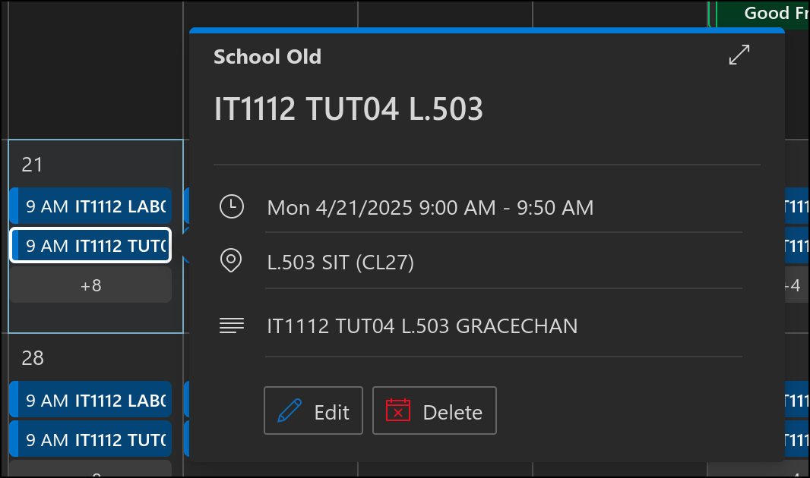
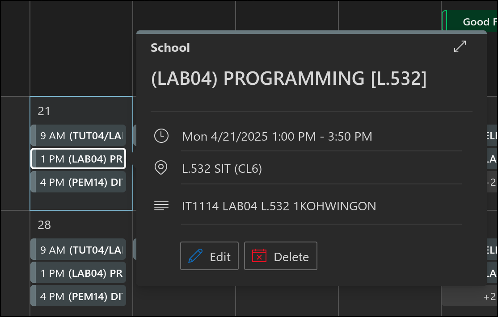
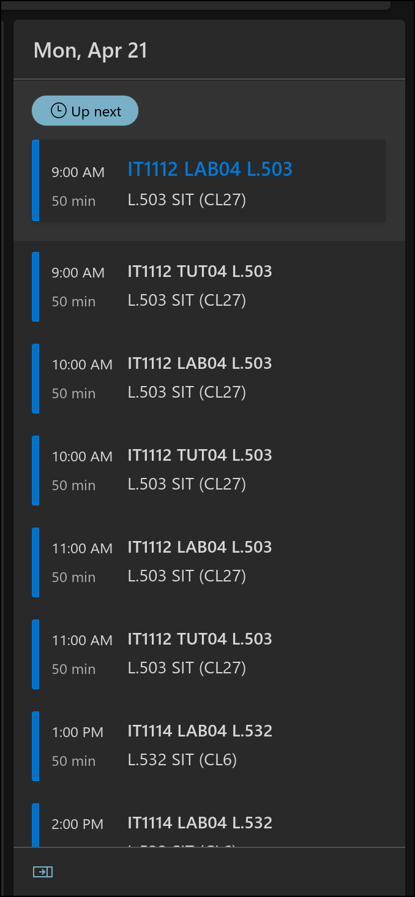
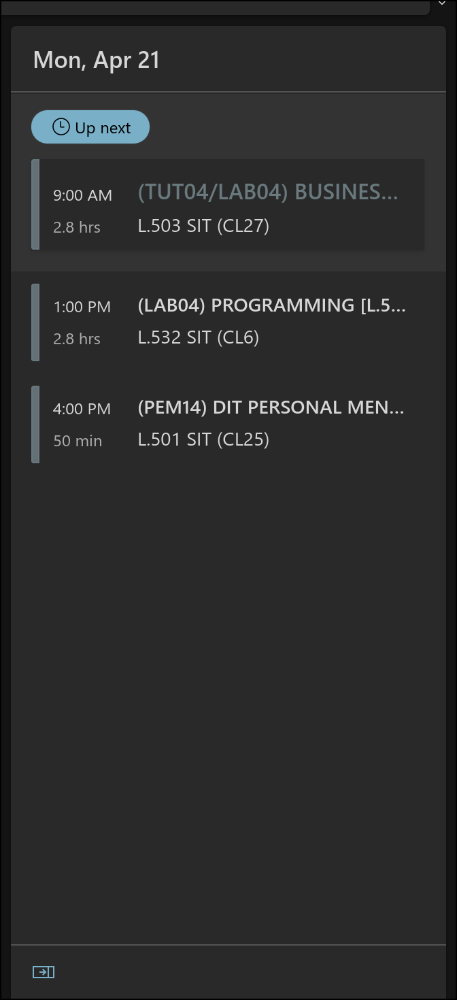

# NYPTimetableFormatter
A script to reformat a valid NYP timetable from an .ics file so that it is easier to read in the calendar.

| **BEFORE**              | **AFTER**              |
|-------------------------|------------------------|
|  |  |
|  |  |

## Requirements
**Note:** Python 3 is required to run program. A web version of this program is in development.
 - [Python 3](https://www.python.org/)
 - A valid NYP timetable in an `.ics` file format. (See [Usage](#usage) for information on how to download your timetable as an `.ics` file.) 


## Usage
**NOTE:** If module name does not change in outputted file, update `MODULE_NAME_MAPPING` with your own modules in `main.py`. <br/>
Download your timetable as an `.ics` file by going to [My NYP Portal](https://mynypportal.nyp.edu.sg/en/dashboard.html) > `Academic Matters` > `Timetables and Exams` > `View Individual Timetable` > `Submit` > `Add to Calendar` > `Download`
```commandline
git clone https://github.com/AzlanCoding/NYPTimetableFormatter
python3 -m venv venv
source ./venv/bin/activate
pip install -r requirements.txt
python3 main.py /path/to/moduletimetable.ics ./out.ics
```
Using the generated file, you can add the `.ics` file to your Google Calendar, Outlook Calendar, Apple Calendar, etc.<br/>
To do so, search Google for instructions :)


## TODO
- [ ] Web version via pyodide
- [ ] Support for adding alarms